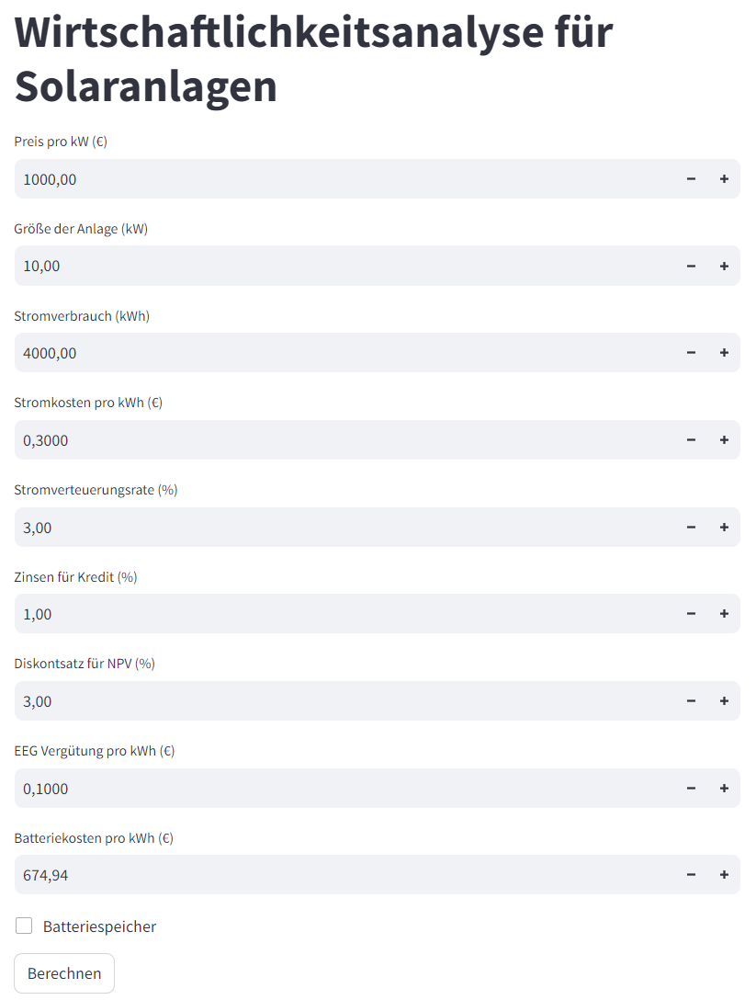

# Wirtschaftlichkeitsanalyse für PV-Dachanlagen aus Kundensicht

Dieses Projekt ermöglicht es, die Wirtschaftlichkeit von Investitionen in Photovoltaik-Dachanlagen zu analysieren. Es erstellt jeweils ein Energiesystem und führt eine Sensitivitätsanalyse durch, um zu verstehen, wie verschiedene Eingabeparameter die Rentabilität beeinflussen. Die Analyse erfolgt mittels einer benutzerfreundlichen Streamlit-App.

## Projektbeschreibung

Das Ziel dieses Projekts ist es, Benutzern – insbesondere Kunden im PV-Dachbereich – zu ermöglichen, eine Wirtschaftlichkeitsanalyse für PV-Dachanlagen durchzuführen. Das Programm bewertet Investitionen aus der Sicht des Kunden und erstellt ein entsprechendes Energiesystem, um die Wirtschaftlichkeit zu berechnen. So kann unabhängig berechnet werden, ob sich eine PV-Anlage lohnt. Nächste Schritte sind:
- die Optimierung der Batteriegröße im in der Modellierung.
- Die Einbindung der renewables Ninja API für standortbezogene Wetterdaten
- Auswahlmöglichkeiten von verschiedenen Lastgängen inklusive opt in von planbaren Verbrauchern wie einem E-Auto oder einer Wärmepumpe
## Technologien

- Python
- Streamlit
- Pandas
- NumPy
- Matplotlib
- PyPSA
- Excel für Ergebnisdarstellung

## Installation und Einrichtung

Um das Projekt einzurichten, führen Sie folgende Schritte aus:

```bash
git clone <https://github.com/oveknutzen/Wirtschaftlichkeit_Kunde.git>
cd <Wirtschaftlichkeit_Kunde>
pip install -r requirements.txt
```

## Benutzung

Starten Sie die Streamlit-App mit:

```bash
streamlit run App_Wirtschaft.py
```

Navigieren Sie in Ihrem Webbrowser zur angezeigten URL, um die App zu verwenden.

## Dateistruktur

- `App_Wirtschaft.py`: Die Hauptanwendung für die Streamlit-Oberfläche.
- `Energiesystem1.py`: Modul zur Erstellung und Berechnung des Energiesystems.
- `sensitivity_analysis.py`: Modul zur Durchführung der Sensitivitätsanalyse.
- `Wirtschaftlichkeit.py`: Modul zur Berechnung der Wirtschaftlichkeit aus Kundensicht.
- `Haushaltslastprofile.csv`: CSV-Datei mit Lastprofilen der Haushalte.
- `ninja_weather_51_9.csv`: Wetterdaten für die Energieproduktionssimulation.

## Beitrag

Wenn Sie zum Projekt beitragen möchten, können Sie gerne Pull Requests stellen oder Issues im Repository eröffnen.

## Oberfläche



## Lizenz

Dieses Projekt ist unter der MIT Lizenz im Rahmen einer Masterarbeit an der FH Münster erstellt worden.

## Autoren

Kim Ove Knutzen
K.E.S. Knutzen Energy Solutions GmbH

---
